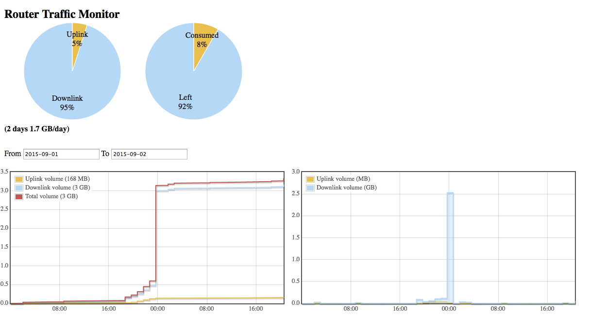

# Traffic

I have a need to monitor the network traffic over my Mobile Broadband 4G router, Huawei B593 (SW Rev V100R001C07SP102
and HW Rev. B).

By subscription of my ISP (Telia), I have a maximum volume of 40GB/month, additional traffic will need extra payment.

Since my family (including two youngster) is using the router, data traffic easily exceed max.
Hence I set out to have traffic monitored and easily accessible.

The result is shared by this project even though I would be surprised if anyone would be interested.
I did this as a fun learning exercise, so it might seem to be an overkill but that's alright for me.

## Overview

A Raspberry Pi running a background 'collector' Python script once per hour. 
The script logs onto the B593 router, read relevant information and store the samples into a Mongo database. 
The same script will trigger a notification on twitter if the consumed volume exceed a predefined limit. 
It will as well tweet a daily summary.

The router data 2 web pages that will in a graphical format present the traffic load either by
reading from the database or providing a realtime view. The webpages are programmed by Javascript using 
[jQuery](https://jquery.com/), [Flot](http://www.flotcharts.org/) and
[Highcharts](http://www.highcharts.com/). The webserver ([nginx](http://nginx.org/)) runs on the Raspberry Pi and 
use a Python 'emitter' script to provide a data response.
The Python emitter script uses [Flask](http://flask.pocoo.org/) and nginx is used as a HTTP proxy to
[gunicorn](http://gunicorn.org/) WSGI HTTP server running the emitter script.

For those who wants a simpler solution than above can have a look into the 'simple' directory however.

The detailed information is created through Sphinx where more details on the implementation is provided.

## Folders

* **B593js** have some javascripts from the router, used only for reference
* **doc** is the Sphinx documentation root
* **js** includes all javascripts used by the web pages, it includes jQuery, flot and highcharts scripts, css files and 
`traffic.js`. This javascript is the main implementation of the client web pages `index.html` and `rt.html`
* **pem** have the c implementation to create the `rt.pem` file, see additional documentation what this is
* **py** includes all Python scripts
* **simple** includes implementation for 'simple' implementation and usage of this project, see documentation
* **util** includes all relevant configuration files for the programs used

## Installation

Not automated (yet...if ever), so download/clone everything from github.

I use Python [`virtualenv`](https://virtualenv.pypa.io/en/latest/), 
[`virtualenvwrapper`](https://virtualenvwrapper.readthedocs.org/en/latest/)and 
[`autoenv`](https://github.com/kennethreitz/autoenv), all very much recommended. 
So start with these commands in a terminal (examples below is for Raspbian running on my Raspberry Pi)

    $ sudo apt-get update
    $ sudo apt-get upgrade
    $ sudo apt-get install python-setuptools
    $ sudo easy_install pip
    $ sudo pip install virtualenv
    $ sudo pip install virtualenvwrapper
    $ sudo pip install autoenv

My virtualenv root is at ~/.virtualenvs, so update `~/.bashrc` accordingly

    export WORKON_HOME=$HOME/.virtualenvs 
    export PROJECT_HOME=$HOME/app
    source /usr/local/bin/virtualenvwrapper.sh
    source /usr/local/bin/activate.sh

Then create `.env` file in the folder were the Traffic project root is located with this content `workon Traffic`. 
When changing directory (cd) into the folder were the `.env` is located will automatically trigger the `virtualenv`.

Then you need to install the Mongo database. I have done this for both OSX (where I develop Traffic) and for my 
Raspberry as below

### Mongo for OSX

I use Brew, so use these commands

    $ brew update
    $ brew install mongodb
    ==> Downloading https://homebrew.bintray.com/bottles/mongodb-3.0.4.mavericks.bottle.tar.gz
    ######################################################################## 100.0%
    ==> Pouring mongodb-3.0.4.mavericks.bottle.tar.gz
    ==> Caveats
    To have launchd start mongodb at login:
      ln -sfv /usr/local/opt/mongodb/*.plist ~/Library/LaunchAgents
    Then to load mongodb now:
      launchctl load ~/Library/LaunchAgents/homebrew.mxcl.mongodb.plist
    Or, if you don't want/need launchctl, you can just run:
      mongod --config /usr/local/etc/mongod.conf
    ==> Summary
    🍺  /usr/local/Cellar/mongodb/3.0.4: 17 files, 154M

See the Caveats notes above and follow the instructions.

The content of my `/usr/local/etc/mongodb.conf`

    systemLog:
      destination: file
      path: /usr/local/var/log/mongodb/mongo.log
      logAppend: true
    storage:
      dbPath: /usr/local/var/mongodb
    net:
      bindIp: 127.0.0.1

### Mongo for RPi

For installation see [https://emersonveenstra.net/mongodb-raspberry-pi/](MongoDB)
I did

    $ mkdir mongodb
    $ git clone https://github.com/svvitale/mongo4pi
    $ cd mongodb/mongo4pi
    $ sudo sh install.sh

To enable journal (in case of unexpected reboot), I added to ´/etc/init.d/mongod' this row
    
    DAEMON_OPTS="$DAEMON_OPTS --journal"
    
If journal is not enabled and unexpected reboot happens a lock file exists and will prevent further operations vs the 
mongo database and must be removed and mongo restarted by

    $ sudo rm /var/lib/mongodb/mongod.lock
    $ sudo /etc/init.d/mongod restart

This should not be necessary when enabling journaling (default enabled for 64-bit mongo, see 
[http://docs.mongodb.org/master/tutorial/manage-journaling/](http://docs.mongodb.org/master/tutorial/manage-journaling/)

### Installation continued

To install additional packages and tools, do

    sudo apt-get install python-dev
    pip install pycrypto (in virtualenv)
    pip install pymongo (in virtualenv)
    pip install flask (in virtualenv)
    sudo apt-get install nginx (not in virtualenv)
    pip install gunicorn (in virtualenv)
    sudo apt-get install supervisor (not in virtualenv)
    sudo pip install python-twitter (in virtualenv)

To permanently remove Apache2 from startup (using nginx instead) do `sudo update-rc.d -f apache2 remove`

ngnix root is at '/usr/share/nginx/www'.
nginx is running as a daemon, control this through

    $ /etc/init.d/nginx status
    $ /etc/init.d/nginx restart, or $ /etc/init.d/nginx stop $ /etc/init.d/nginx start

supervisor is a handy tool for monitoring daemons, so see <http://supervisord.org/introduction.html> and 
<http://www.hackedexistence.com/project/raspi/django-on-raspberry-pi.html> for further details

Install and configure supervisor

    $ sudo apt-get install supervisor
    $ sudo nano /etc/supervisor/conf.d/gunicorn.conf

Add the following to the gunicorn.conf file, changing the paths for python and gunicorn to be where you installed them 
and test_project_name to be replaced by the name of your project:

    [program:gunicorn]
    command = /home/pi/bin/python /home/pi/bin/gunicorn test_project_name.wsgi:application
    directory = /home/pi/test_project_name
    user = pi
    autostart = true
    autorestart = true
    stdout_logfile = /var/log/supervisor/gunicorn.log
    stderr_logfile = /var/log/supervisor/gunicorn_err.log

Restart supervisor to have it grab the changes

    $ sudo supervisorctl reread
    $ sudo supervisorctl update
    $ sudo supervisorctl status
    $ sudo supervisorctl restart all
 
or 

    $ sudo service supervisor restart or $ sudo supervisorctl restart all
    $ sudo supervisorctl start gunicorn

The traffic daemon (the `collector.py` script) runs 1/hour and restart on failure as well on system startup

    $ sudo cp /home/pi/app/Traffic/util/traffic.conf /etc/supervisor/conf.d/
    $ sudo supervisorctl reread
    $ sudo supervisorctl update

For python-twitter we need to generate twitter keys, see 
<https://dev.twitter.com/oauth/overview/application-owner-access-tokens>

For Sphinx theme, see https://pypi.python.org/pypi/alabaster

    $ pip install alabaster

## Misc

Change hostname on raspeberry see 
<http://www.howtogeek.com/167195/how-to-change-your-raspberry-pi-or-other-linux-devices-hostname/>

I use the domain `viltstigen.se` with the obvious subdomain `www.viltstigen.se`.
It is registered at [Binero](http://www.binero.se). To this I am using their dynamic DNS service as I don't 
have a static by my ISP (Telia). My router does not have a dynamic DNS client included.

An alternative (not tested) is to use the free [namecheap](https://www.namecheap.com/) service, see this blog entry 
[http://mwholt.blogspot.se/2013/09/how-to-set-up-dynamic-dns-in-5-minutes.html]

to keep the dynamic WAN IP address of my router updated to Binero DNS I have added this to my RPi crontab
`00 *    * * *   root    curl -u 'Username:Password' -d 'hostname=www.viltstigen.se' 'https://dyndns.binero.se/nic/update' >/dev/null 2>&1`
This is inline with Binero documentation, running every hour. It will make a POST using the information after the -d option.

In the Binero DNS configuration I use the A record for `www.viltstigen.se`

 